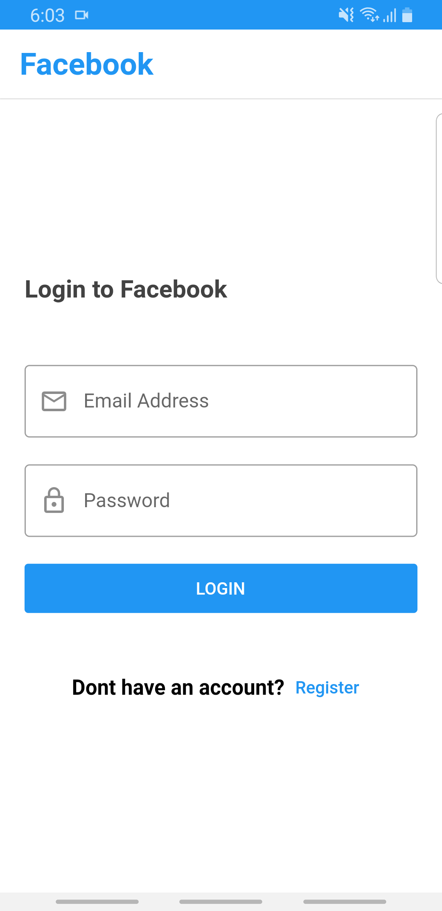
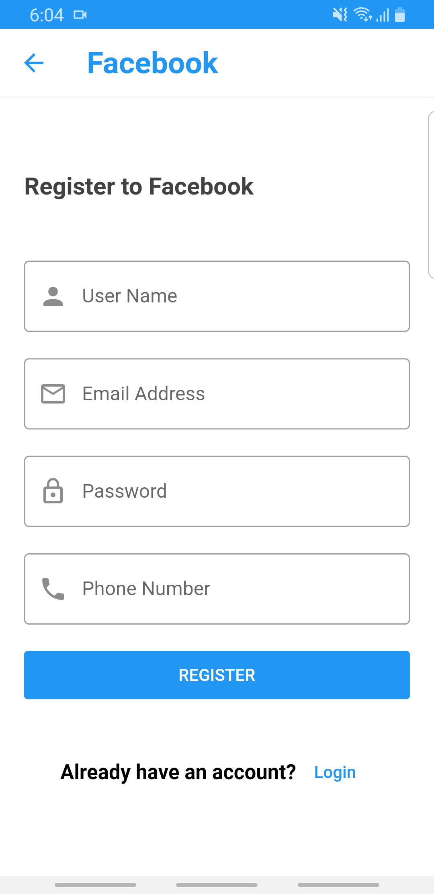
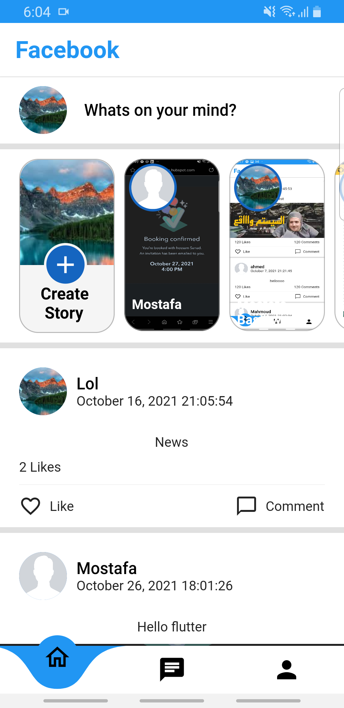
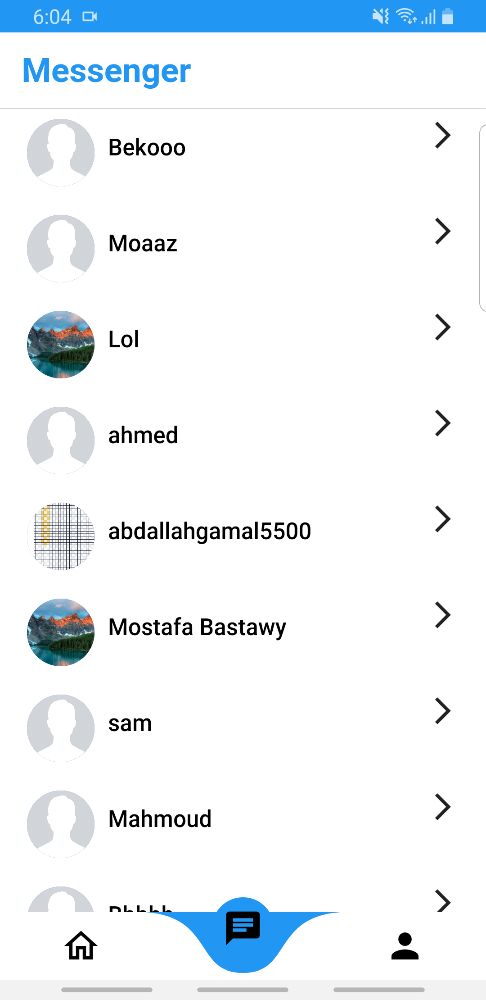
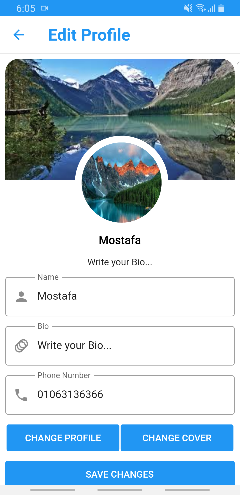
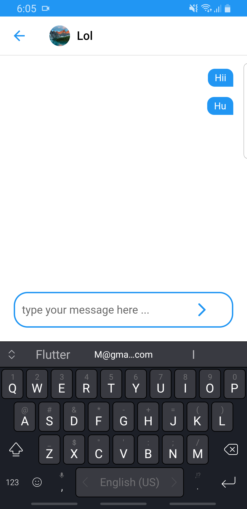

# noon_clone

This is a full Social App. I made by using Firebase (Authentication, Firestore Database, Storage),and State Management (Bloc). This app give the user ability to share posts, share stories, chat with other users and edit his profile information & profile picture & cover Picture.

## Tools
- Authentication: Firebase Authentication
- Backend: Firebase Firestore
- State management:
    - Bloc Design Pattern

- Packages:
    - shared_preferences
    - flutter_bloc
    - bloc
    - curved_navigation_bar
    - firebase_auth
    - firebase_core
    - cloud_firestore
    - firebase_storage
    - image_picker
    - intl
    - conditional_builder_null_safety

## Video

<!DOCTYPE html>
<html>
<body>

<video width="320" height="240" controls>
  <source src="https://user-images.githubusercontent.com/81096412/139437191-0541077e-7405-428d-a62c-af63a8300d4b.mp4">
</video>

</body>
</html>

## Screenshots

<table>
  <tr>
    <td></td>
    <td></td>
    <td></td>
  </tr>
 </table>

<table>
  <tr>
    <td></td>
    <td></td>
    <td></td>
  </tr>
 </table>
